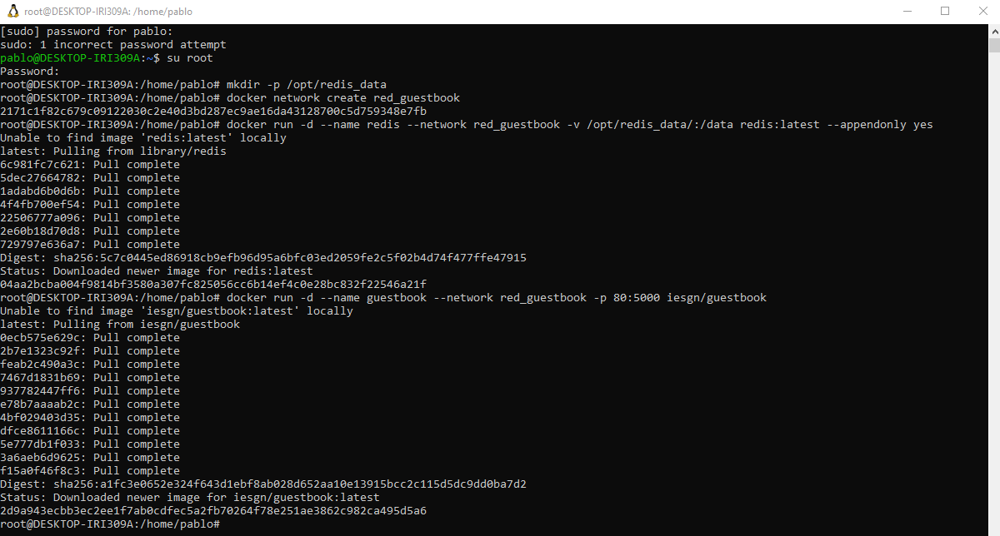
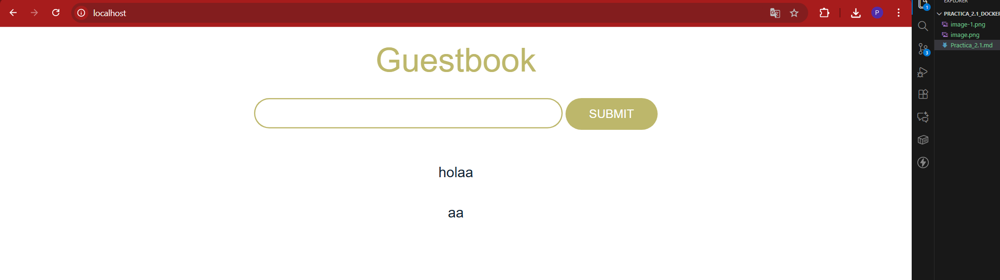
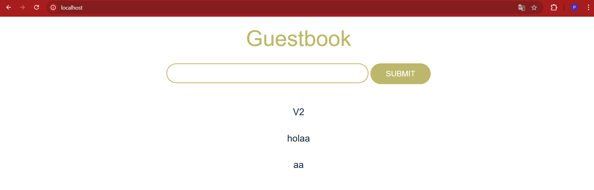

## Práctica 2.1: Aplicación Guestbook

### Preparativo para comenzar la práctica

En la terminal ejecutamos:

```
mkdir -p /opt/redis_data
```

Para crear la carpeta de almacenamiento persistente de Redis.

### Parte 1: Despliegue básico de Guestbook

### Apartado 1.1: Preparación del entorno

Creamos red docker personalizada:

```
docker network create red_guestbook
```

Este comando nos creará una red aislada llamada red_guestbook.

### Apartado 1.2: Despliegue del servicio de base de datos Redis

Creamos y ejecutamos contenedor Redis con persistencia y conectado a red:

```
docker run -d --name redis --network red_guestbook -v /opt/redis_data:/data redis:latest --appendonly yes
```

### Apartado 1.3: Despliegue del servicio web Guestbook

Creamos y ejecutamos contenedor Guestbook conectado a la red y exponiendo puerto 80 local:

```
docker run -d --name guestbook --network red_guestbook -p 80:5000 iesgn/guestbook
```

**Comandos ejecutados hasta ahora**


**Contenedores creados automaticamente**


**Despliegue de contenido en el localhost**


### Apartado 1.4: Verificación de persistencia

Paramos y eliminamos el contenedor de Redis para comprobarlo

```
docker stop redis
docker rm redis
```

Verificamos que los archivos siguen en la carpeta local (/opt/redis_data).

Y volvemos a crear el contenedor exactamente igual que antes:

```
docker run -d --name redis --network red_guestbook -v /opt/redis_data:/data redis:latest --appendonly yes
```

### Parte 2: Configuración personalizada

### Apartado 2.1: Cambio del nombre del contenedor de base de datos

1 - Eliminamos los contenedores anteriores manteniendo los datos y red:

```
docker rm -f redis guestbook

```

2 - Creamos un contenedor Redis con el nombre nuevo, que será bd_guestbook:

```
docker run -d --name bd_guestbook --network red_guestbook -v /opt/redis_data:/data redis:latest --appendonly yes
```

3 - Creamos contenedor Guestbook configurando la variable de entorno REDIS_SERVER que contendra el nuevo nombre

```
docker run -d --name guestbook --network red_guestbook -p 80:5000 -e REDIS_SERVER=bd_guestbook iesgn/guestbook
```

4 - Accedemos al local host:




# Tarea 3.1: Análisis de la arquitectura

## Redes Docker

### ¿Por qué es necesario crear una red personalizada en lugar de usar la red por defecto de Docker?

La red por defecto funciona, pero es menos segura y no tiene DNS automático. Con una red personalizada, los contenedores solo ven a otros contenedores en esa red, están más aislados. Además, es más limpio tener una red para cada aplicación, así no se mezclan contenedores de diferentes proyectos.

### ¿Cómo se comunican los contenedores dentro de la red red_guestbook?

Se comunican por nombres. Guestbook le dice "quiero conectar con redis" y Docker resuelve ese nombre internamente a la IP del contenedor redis. Es como si tuvieran teléfonos internos en una empresa: no necesitan saber el número exacto, solo el nombre.

### ¿Qué ventaja proporciona la resolución DNS automática de Docker?

Que no tenemos que saber qué IP tiene cada contenedor. La IP puede cambiar, pero el nombre siempre es el mismo. Guestbook siempre usará el nombre "redis", sin importar la IP interna. Es mucho más cómodo que tener que actualizar direcciones IP.

## Volúmenes

### ¿Por qué es importante usar volúmenes para la base de datos?

Para que los datos persistan. Si Redis está dentro del contenedor sin volumen, cuando eliminas el contenedor, se pierden todos los mensajes del guestbook. Con volumen, los datos se guardan en la máquina host y permanecen incluso si borramos el contenedor.

### ¿Qué pasaría si no usáramos un volumen para Redis?

Cada vez que para el contenedor o lo eliminas, pierdes todos los datos. El guestbook estaría vacío. Para una aplicación de prueba va bien, pero para algo real es desastre.

### ¿Qué diferencias existen entre un volumen y un bind mount?

Un volumen es gestionado por Docker, está en una carpeta que Docker controla. Un bind mount apunta directamente a una carpeta de tu máquina como vimos en clase. Con volumen, Docker se encarga de la organización. Con bind mount, ves los archivos en tu carpeta. Volumen es mejor para datos de aplicaciones, bind mount para archivos que quieres ver/editar.

## Variables de entorno

### ¿Qué función cumple la variable de entorno REDIS_SERVER?

Decirle a Guestbook dónde está Redis. Guestbook la lee y se conecta a ese servidor. Por defecto vale "redis", pero si la cambias a mi_redis_personalizado", Guestbook buscaría a "mi_redis_personalizado" en la red.

### ¿Cómo se pasa una variable de entorno a un contenedor en Docker?

Con la opción `-e NOMBRE=valor` en el comando docker run. Por ejemplo: `docker run -e REDIS_SERVER=redis_nuevo`. Puedes poner varias: `docker run -e VAR1=valor1 -e VAR2=valor2`.


## Puertos

### ¿Por qué no es necesario exponer el puerto de Redis al host?

Porque Guestbook lo accede desde dentro de la red Docker, no necesita salir al host. Redis y Guestbook hablan entre ellos sin que el host se entere. Es como tener dos habitaciones conectadas: no necesitan abrir la puerta al exterior.

### ¿En qué casos sería necesario exponer el puerto de la base de datos?

Si quieres conectar a Redis desde tu máquina con una herramienta de administración, o si tienes otra aplicación fuera de Docker que necesita acceder a Redis. Pero normalmente no es necesario en entornos normales. Si lo haces, cuidado con la seguridad.
