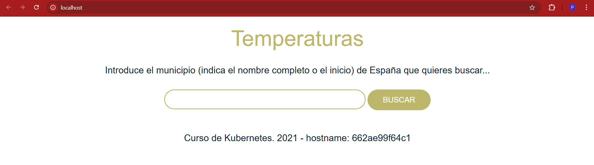
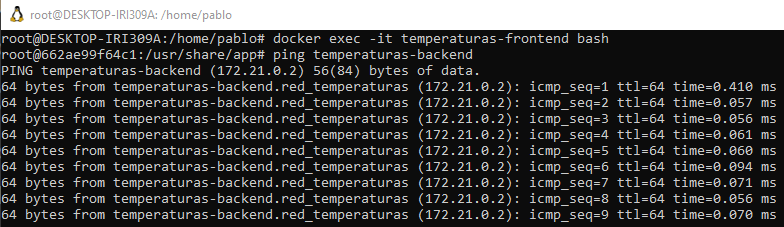
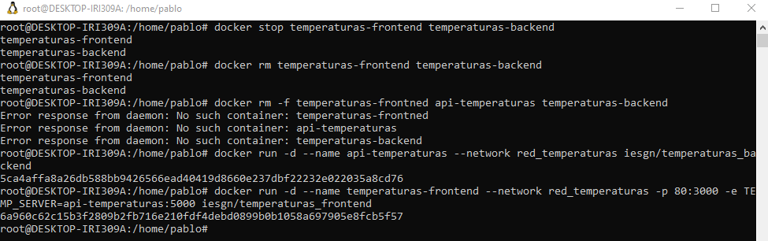
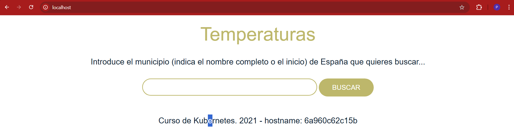
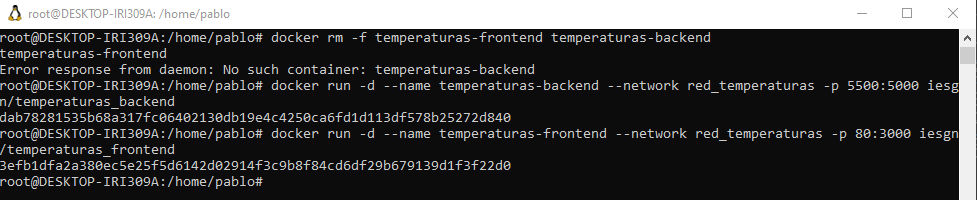
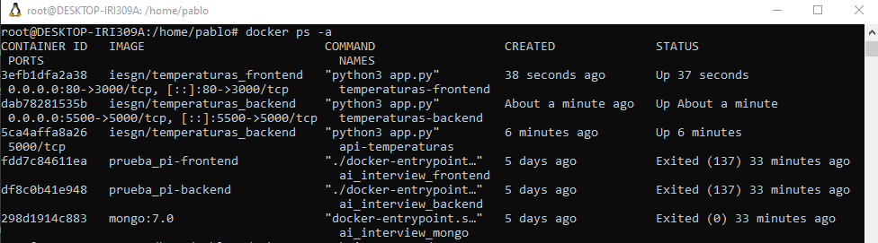
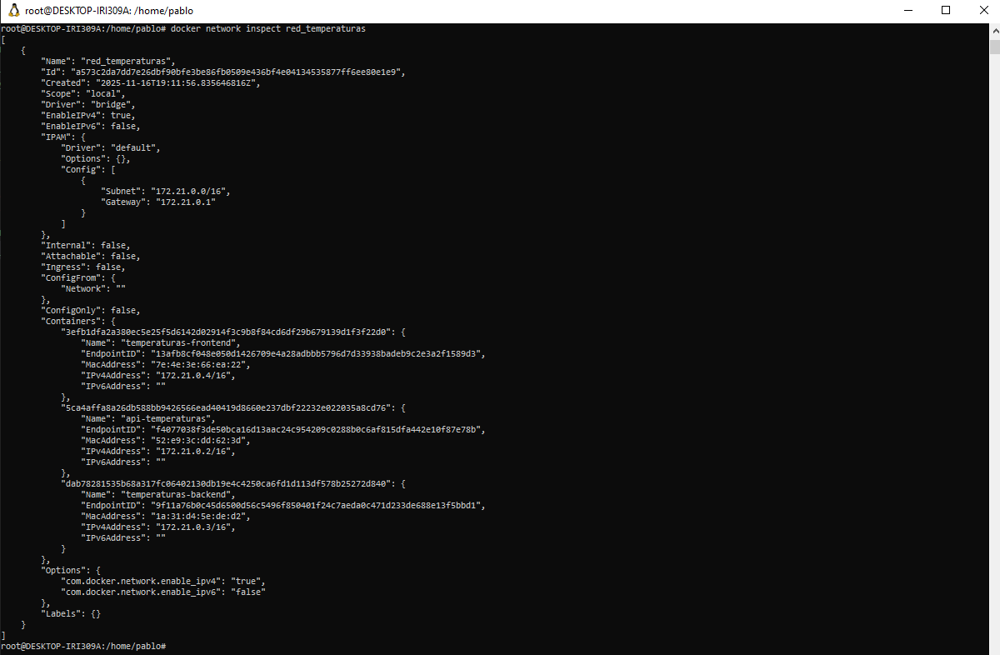

## Práctica 2.2: Aplicación Termperaturas

### 1. Preparación del entorno

Creamos la red personalizada:

```
docker network create red_temperaturas
```

### 2. Despliegue del backend

Se lanza el microservicio backend:

```
docker run -d --name temperaturas-backend --network red_temperaturas iesgn/temperaturas_backend
```

con docker ps podemos verificar si esta en funcionamiento, saldria `temperaturas-backend`.

### 3. Despliegue del frontend.

Se lanza el microservicio frontend:

```
docker run -d --name temperaturas-frontend --network red_temperaturas -p 80:3000 iesgn/temperaturas_frontend
```





### 4. Comprobación de comunicación entre los microservicios.

Terminal frontend:

```
docker exec -it temperaturas-frontend bash
```

ping al backend por nombre:

```
ping temperaturas-backend
```

### 5. Aplicaciones sin estado (stateless)
Detenemos y eliminamos ambos contenedores:

```
docker stop temperaturas-frontend temperaturas-backend
docker rm temperaturas-frontend temperaturas-backend
```

Volvemos a crear los contenedores con los mismos comandos, sin pérdida de información, porque no guarda datos persistentes.

### 6. Configuración personalizada (nombre del backend)

Borramos los contenedores

```
docker rm -f temperaturas-frontend api-temperaturas temperaturas-backend
```

Volvemos a crear backend, pero con otro nombre:

```
docker run -d --name api-temperaturas --network red_temperaturas iesgn/temperaturas_backend
```

Ahora arrancamos el front diciendole el nuevo backend con la variable de entorno TEMP_SERVER

```
docker run -d --name temperaturas-frontend --network red_temperaturas -p 80:3000 -e TEMP_SERVER=api-temperaturas:5000 iesgn/temperaturas_frontend
```




### 7. Cambio del puerto del backend

Borramos los contenedores manteniendo la red y creamos backend con el puerto 5500

```
docker rm -f temperaturas-frontend temperaturas-backend

docker run -d --name temperaturas-backend --network red_temperaturas -p 5500:5000 iesgn/temperaturas_backend
```

Ejecutamos frontend de la misma manera:

```
docker run -d --name temperaturas-frontend --network red_temperaturas -p 80:3000 iesgn/temperaturas_frontend
```




### 8 Verificar lista de contenedores y redes.

con `docker ps -a`



y para la red:

```
docker network inspect red_temperaturas
```




# Tarea 4.1: Análisis de la arquitectura de microservicios

## Microservicios

### ¿Qué ventajas ofrece separar la aplicación en dos microservicios (frontend y backend)?

Poder actualizar el frontend sin tocar el backend y viceversa. Si el frontend tiene un bug, no afecta al backend. Cada equipo puede trabajar en su parte sin que moleste al otro. También permite escalar cada parte por separado según sea necesario.

### ¿Cómo se comunican los microservicios entre sí?

El frontend hace peticiones HTTP al backend a través de la red Docker. Le pide datos por ejemplo de temperaturas, y el backend le responde con esos datos en formato JSON. Se comunican a través de URLs del tipo `http://temperaturas-backend:5000/api/municipios`.

### ¿Qué pasaría si el microservicio backend fallara?

El frontend no podría conseguir datos y mostraría un error. El sitio dejaría de funcionar. Por eso es importante tener el backend disponible y, en producción, tener backups o réplicas.

## Aplicaciones sin estado

### ¿Qué significa que una aplicación sea "sin estado"?

Que la aplicación no guarda información entre peticiones. No necesita acordarse de quién eres o qué hiciste antes. Cada petición es independiente. El frontend solicita datos, el backend responde, y se olvida de todo. No hay sesiones guardadas.

### ¿Qué ventajas tiene este tipo de aplicaciones en entornos contenerizados?

Es muy fácil escalar. Si necesitas más capacidad, lanzas otro contenedor igual y listo. No hay problema con compartir datos entre contenedores porque el estado no se comparte. Puedes eliminar y crear contenedores sin perder nada importante.

### ¿Qué diferencias existen con la aplicación Guestbook (que sí tiene estado)?

Guestbook guarda todos los mensajes en Redis. Necesita recordar qué mensajes existen. Si Guestbook fuera sin estado, cada vez que cargaras la página verías mensajes diferentes. Temperaturas no guarda nada, solo responde con los datos que tiene. Por eso Temperaturas es más fácil de replicar y escalar.

## API REST

### ¿Qué es una API REST?

Es una forma de comunicación entre aplicaciones usando HTTP. El cliente (frontend) hace peticiones (GET, POST, PUT, DELETE) a direcciones específicas (endpoints), y el servidor (backend) devuelve datos, normalmente en formato JSON.

### ¿Por qué el backend se implementa como una API REST?

Porque permite que cualquier cliente (web, móvil, otra aplicación) pueda pedir datos de la misma forma. Es estándar y fácil de usar. El frontend solo hace llamadas HTTP y recibe JSON, sin necesidad de saber cómo funciona internamente el backend.

### ¿Qué tipo de peticiones HTTP crees que realiza el frontend al backend?

Probablemente peticiones GET para obtener datos de municipios y temperaturas. Algo como `GET /api/municipios` para conseguir la lista, o `GET /api/municipios/madrid/temperaturas` para obtener temperaturas de un municipio específico.


## Aislamiento y seguridad

### ¿Por qué no es necesario exponer el puerto del backend al host?

Porque el frontend ya está dentro de la red Docker y puede acceder al backend internamente. No necesita salir al host. Si lo expusiéramos, cualquiera desde fuera podría conectarse directamente al backend, lo que no es necesario y es un riesgo.

### ¿Qué ventajas de seguridad ofrece esta configuración?

El backend está protegido. Solo el frontend puede hablar con él. No está expuesto a Internet ni a otros usuarios. Es más difícil hacerle un ataque porque no está visible desde fuera.

### ¿En qué casos sería necesario exponer el backend?

Si queremos que clientes externos (como una aplicación móvil o un cliente web en otro servidor) accedan directamente al backend. Pero entonces hay que cuidar mucho la seguridad: usar autenticación, HTTPS, controlar quién puede acceder, etc.


## Escalabilidad

### ¿Cómo podrías escalar esta aplicación para soportar más usuarios?

Podrías lanzar múltiples contenedores del frontend y backend, y usar un balanceador de carga (como Nginx) que distribuya las peticiones entre ellos. Así las solicitudes no caen todas en un solo contenedor.

### ¿Podrías ejecutar múltiples instancias del backend? ¿Y del frontend?

Sí a ambas. Puedes tener 3 backends respondiendo peticiones y un balanceador decidiendo a cuál enviar cada petición. Con el frontend igual. El único problema es que todos necesitan conectar a la misma base de datos de temperaturas (aunque en este caso es solo lectura, así que no hay conflictos).
