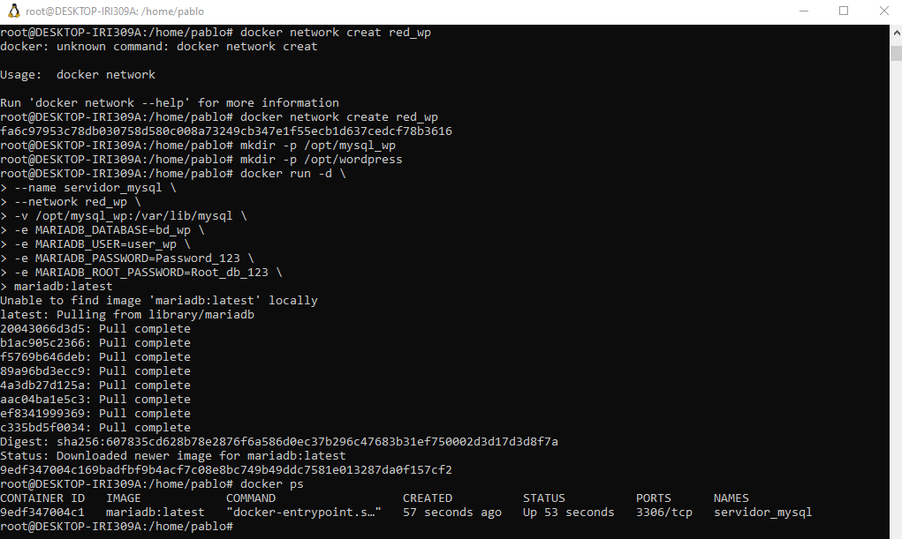
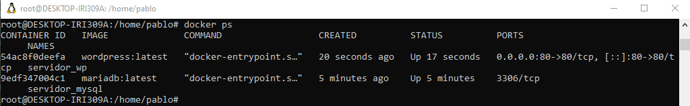

## Práctica 2.3: WordPress con MariaDB


### 1. Preparación del entorno

Creamos la red personalizada:

```
docker network create red_wp
```

Creamos los directorios para persistencia de datos:

```
sudo mkdir -p /opt/mysql_wp
sudo mkdir -p /opt/wordpress
```


### 2. Despliegue de MariaDB

Lanzamos el contenedor de base de datos MariaDB:

```
docker run -d \
  --name servidor_mysql \
  --network red_wp \
  -v /opt/mysql_wp:/var/lib/mysql \
  -e MARIADB_DATABASE=bd_wp \
  -e MARIADB_USER=user_wp \
  -e MARIADB_PASSWORD=Passwd_123 \
  -e MARIADB_ROOT_PASSWORD=Root_db_123 \
  mariadb:latest
```

Con `docker ps` podemos verificar si está en funcionamiento; debería aparecer `servidor_mysql`.

Revisamos los logs de inicialización:

```
docker logs servidor_mysql
```



### 3. Despliegue de WordPress

Se lanza el contenedor de WordPress:

```
docker run -d \
  --name servidor_wp \
  --network red_wp \
  -v /opt/wordpress:/var/www/html/wp-content \
  -e WORDPRESS_DB_HOST=servidor_mysql \
  -e WORDPRESS_DB_USER=user_wp \
  -e WORDPRESS_DB_PASSWORD=Passwd_123 \
  -e WORDPRESS_DB_NAME=bd_wp \
  -p 80:80 \
  wordpress:latest
```

Con `docker ps` verificamos que ambos contenedores están corriendo.

Accedemos a WordPress desde el navegador en `http://localhost` y completamos la instalación.




### 4. Configuración de WordPress

Desde el navegador, iniciamos sesión como administrador y creamos:

- 2 páginas
- 3 entradas (posts)
- 1 categoría personalizada
- Cambia el tema a uno distinto del predeterminado
- Instala y activa al menos un plugin


### 5. Persistencia de WordPress

Detenemos y eliminamos solo el contenedor de WordPress:

```
docker stop servidor_wp
docker rm servidor_wp
```

Verificamos que los archivos persisten en el host:

```
ls /opt/wordpress
```

Volvemos a crear el contenedor de WordPress:

```
docker run -d \
  --name servidor_wp \
  --network red_wp \
  -v /opt/wordpress:/var/www/html/wp-content \
  -e WORDPRESS_DB_HOST=servidor_mysql \
  -e WORDPRESS_DB_USER=user_wp \
  -e WORDPRESS_DB_PASSWORD=Passwd_123 \
  -e WORDPRESS_DB_NAME=bd_wp \
  -p 80:80 \
  wordpress:latest
```

Accedemos a localhost y verificamos que todo el contenido, tema y plugins siguen presentes.

### 6. Persistencia de la base de datos

Detenemos y eliminamos ambos contenedores:

```
docker stop servidor_wp servidor_mysql
docker rm servidor_wp servidor_mysql
```

Verificamos que los datos persisten en el host:

```
ls /opt/mysql_wp
```

Volvemos a crear ambos contenedores con la misma configuración:

```
docker run -d \
  --name servidor_mysql \
  --network red_wp \
  -v /opt/mysql_wp:/var/lib/mysql \
  -e MARIADB_DATABASE=bd_wp \
  -e MARIADB_USER=user_wp \
  -e MARIADB_PASSWORD=Passwd_123 \
  -e MARIADB_ROOT_PASSWORD=Root_db_123 \
  mariadb:latest
```

```
docker run -d \
  --name servidor_wp \
  --network red_wp \
  -v /opt/wordpress:/var/www/html/wp-content \
  -e WORDPRESS_DB_HOST=servidor_mysql \
  -e WORDPRESS_DB_USER=user_wp \
  -e WORDPRESS_DB_PASSWORD=Passwd_123 \
  -e WORDPRESS_DB_NAME=bd_wp \
  -p 80:80 \
  wordpress:latest
```

Accedemos a WordPress y verificamos que toda la información se mantiene.


### 7. Comprobación de comunicación entre contenedores

Accedemos a una terminal del contenedor de WordPress:

```
docker exec -it servidor_wp bash
```

Hacemos un ping al contenedor de MariaDB por nombre:

```
ping servidor_mysql
```

Probamos acceso al puerto 3306:

```
apt-get update && apt-get install -y telnet
telnet servidor_mysql 3306
```

Salimos del contenedor:

```
exit
```

### 8. Configuración avanzada - Cambio de nombre

Eliminamos ambos contenedores:

```
docker rm -f servidor_wp servidor_mysql
```

Creamos MariaDB con un nombre diferente:

```
docker run -d \
  --name mariadb_wordpress \
  --network red_wp \
  -v /opt/mysql_wp:/var/lib/mysql \
  -e MARIADB_DATABASE=bd_wp \
  -e MARIADB_USER=user_wp \
  -e MARIADB_PASSWORD=Passwd_123 \
  -e MARIADB_ROOT_PASSWORD=Root_db_123 \
  mariadb:latest
```

Arrancamos WordPress apuntando al nuevo nombre:

```
docker run -d \
  --name servidor_wp \
  --network red_wp \
  -v /opt/wordpress:/var/www/html/wp-content \
  -e WORDPRESS_DB_HOST=mariadb_wordpress \
  -e WORDPRESS_DB_USER=user_wp \
  -e WORDPRESS_DB_PASSWORD=Passwd_123 \
  -e WORDPRESS_DB_NAME=bd_wp \
  -p 80:80 \
  wordpress:latest
```

Accedemos a `http://localhost` y verificamos que funciona correctamente.


### 9. Exposición de MariaDB al host

Eliminamos MariaDB:

```
docker rm -f mariadb_wordpress
```

Arrancamos MariaDB exponiendo el puerto 3306 en el puerto 3307 del host:

```
docker run -d \
  --name mariadb_wordpress \
  --network red_wp \
  -v /opt/mysql_wp:/var/lib/mysql \
  -e MARIADB_DATABASE=bd_wp \
  -e MARIADB_USER=user_wp \
  -e MARIADB_PASSWORD=Passwd_123 \
  -e MARIADB_ROOT_PASSWORD=Root_db_123 \
  -p 3307:3306 \
  mariadb:latest
```

Ahora podemos conectar desde un cliente de base de datos (MySQL Workbench, DBeaver, etc.) a `localhost:3307` con las credenciales configuradas.


### 10. Verificar lista de contenedores y redes

Con `docker ps -a`:


Y para inspeccionar la red:

```
docker network inspect red_wp
```


# Tarea 5.1: Preguntas de análisis

## Arquitectura de la aplicación

### ¿Por qué WordPress necesita una base de datos?

WordPress almacena toda la información del sitio en la base de datos: posts, páginas, usuarios, comentarios, configuración del tema, datos de plugins, etc. Sin la base de datos, WordPress no podría guardar nada. La base de datos es como el "cerebro" que guarda toda la información del sitio web.

### ¿Qué tipo de datos se almacenan en la base de datos vs. en el volumen de WordPress?

En la base de datos (MariaDB) se guardan los datos estructurados: posts, páginas, usuarios, comentarios, etiquetas, categorías, configuración, etc.

En el volumen de WordPress se guardan los archivos: imágenes subidas, temas instalados, plugins, archivos del wp-content, etc. Son más "pesados" que los datos estructurados.

### ¿Cómo se comunican WordPress y MariaDB?

Se comunican a través de la red Docker `red_wp`. WordPress usa el nombre del contenedor `servidor_mysql` para conectarse. Docker resuelve ese nombre internamente y dirige la conexión al puerto 3306 de MariaDB. Es como si WordPress llamara a MariaDB por su "nombre" dentro de la red privada Docker.


## Persistencia de datos

### ¿Qué pasaría si no usáramos volumenes?

Si no usamos volumenes, al eliminar los contenedores se pierden todos los datos. Los archivos de WordPress y la base de datos desaparecerían completamente. Sería como si borráramos el sitio web entero cada vez que detenemos un contenedor.

### ¿Por qué es crítico hacer backups de ambos volumenes?

Porque contienen información importante: la base de datos tiene todos los posts, usuarios, comentarios, etc., y el volumen tiene las imágenes, temas y plugins. Si falla el disco duro, se pierden los datos. Los backups permiten recuperar la información si algo se daña.

### ¿Qué estrategias de backup recomendarías para un WordPress en producción?

- Hacer copias automaticas regularmente (diaria o semanal) del volumen de WordPress y la base de datos MariaDB.
- Usar herramientas de backup externas que guarden los datos en otro lugar (nube, otro servidor).
- Guardar backups en diferentes ubicaciones por si falla una.
- Probar que los backups funcionan bien, para estar seguros de que se pueden recuperar cuando sea necesario.


## Seguridad

### ¿Es necesario exponer el puerto de MariaDB al host? ¿Por qué?

No es necesario. En la configuración normal, MariaDB solo es accesible desde dentro de la red Docker (donde está WordPress). No necesita estar expuesto al host ni a Internet. Solo lo expondriamos si quisieramos conectar desde una herramienta externa (como MySQL Workbench) para administrar la base de datos, pero en producción no deberia ser necesario.

### ¿Qué riesgos de seguridad existen al exponer la base de datos?

- Alguien de fuera podría intentar conectarse con contraseñas débiles y acceder a los datos.
- Podrían robar o modificar información del sitio.
- Podrían hacer un ataque de denegación de servicio (DoS).

### ¿Cómo mejorarías la seguridad de este despliegue?

- Usar contraseñas muy seguras (largas, con mayusculas, minusculas, numeros y símbolos).
- Nunca exponer el puerto de MariaDB a Internet, solo a la red interna Docker.
- Usar un cortafuegos para controlar quién puede acceder a los puertos.
- Actualizar regularmente WordPress, plugins y MariaDB para parches de seguridad.
- No usar valores por defecto en las variables de entorno.
- Limitar el acceso a los archivos solo a quien lo necesita.


## Scripts de inicialización

### ¿Qué función cumple el docker-entrypoint.sh en MariaDB?

Es un script que se ejecuta cuando inicia MariaDB. Se encarga de:
- Crear la base de datos especificada en las variables de entorno (bd_wp).
- Crear el usuario y asignarle permisos.
- Inicializar archivos internos de MariaDB.
- Poner en marcha el servicio de base de datos.

### ¿Qué función cumple el docker-entrypoint.sh en WordPress?

Se encarga de:
- Descargar e instalar WordPress si no está presente.
- Configurar la conexión con la base de datos.
- Crear el archivo wp-config.php con las credenciales.
- Preparar WordPress para ser usado.

### ¿En qué momento se crea el archivo wp-config.php?

Se crea la primera vez que se inicia el contenedor de WordPress, a través del script docker-entrypoint.sh. Usa las variables de entorno que pasamos (WORDPRESS_DB_HOST, WORDPRESS_DB_USER, etc.) para generar el archivo. Si el archivo ya existe, el script no lo sobrescribe.


## Comparación con prácticas anteriores

### ¿En qué se diferencia este despliegue de Guestbook?

Guestbook es más simple, tiene una web (Python) y una base de datos (Redis). WordPress es más complejo, tiene una web (PHP + Apache), una base de datos MariaDB en este caso, temas, plugins, etc. Guestbook es un proyecto pequeño, WordPress es una aplicación real con mas carga. Ambos usan volumenes para persistencia, pero WordPress tiene más complejidad.

### ¿En qué se diferencia de la aplicación Temperaturas?

Temperaturas es una arquitectura de microservicios sin estado (frontend y backend). No necesita guardar datos persistentes. WordPress es una aplicación con estado: depende de la base de datos y los volumenes para funcionar. Temperaturas es más escalable porque es sin estado, pero WordPress es más funcional para un sitio web real.

### ¿Cuál es más compleja de mantener y por qué?

WordPress es más compleja de mantener porque:
- Tiene dos servicios (web + base de datos) que deben estar sincronizados.
- Requiere gestión de dos volumenes diferentes.
- Necesita mantener actualizados los plugins, temas y WordPress.
- Tiene más configuración de variables de entorno.
- Requiere más cuidado con la seguridad.

Guestbook y Temperaturas son más simples de mantener porque tienen menos componentes.


## Escalabilidad y alta disponibilidad

### ¿Se podría ejecutar multiples instancias de WordPress conectadas a la misma base de datos?

Sí, es posible, podriamos tener varios contenedores de WordPress apuntando a la misma base de datos MariaDB. Pero se necesitaria un balanceador de carga como nginx que distribuya las peticiones entre los diferentes contenedores de WordPress. También podria haber problemas si dos instancias intentan modificar lo mismo al mismo tiempo.

### ¿Cómo se podría implementar alta disponibilidad en la base de datos?

- Tener varias instancias de MariaDB sincronizadas (replicación).
- Usar un cluster de MariaDB donde si una falla, otra sigue funcionando.
- Hacer backups automaticos constantemente.
- Usar herramientas como Galera Cluster que nos dejarian sincronizar multiples bases de datos.

### ¿Qué limitaciones tiene este despliegue para un entorno de producción?

- No tiene alta disponibilidad: si MariaDB falla, el sitio se cae completamente.
- La base de datos está en un solo contenedor: es un punto unico de fallo.
- No hay mecanismos automaticos de backup.
- No es seguro para internet publico.
- No hay monitoreo automatico de errores.
- Los volumenes están en una sola máquina: si falla el disco, se pierden todos los datos.
